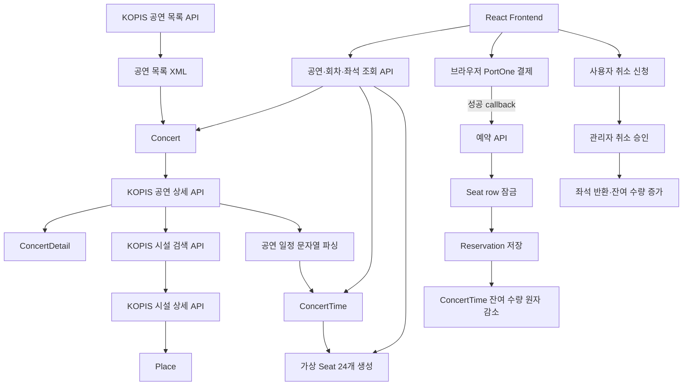
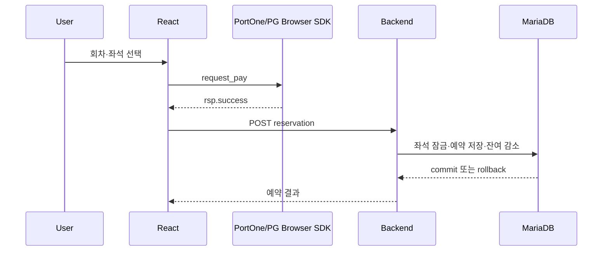

# TicketOnBoarding Backend 아키텍처 학습 기준선

## 1. 문서 목적과 읽는 방법

이 문서는 TicketOnBoarding Backend를 처음 인수한 사람이 화면 뒤에서 어떤 데이터와 코드가 움직이는지 탑다운 방식으로 이해하기 위한 기준선이다. 단순한 클래스 목록이 아니라 다음 질문에 답하는 순서로 구성한다.

1. 이 서비스는 어떤 문제를 다루는가?
2. KOPIS 데이터가 어떻게 공연·회차·가상 좌석으로 바뀌는가?
3. Frontend 요청은 어떤 Controller, Service, Repository와 DB row를 거치는가?
4. 좌석 예약에서 transaction과 lock은 무엇을 보호하는가?
5. 결제·취소·인증은 어디까지 구현되어 있고 어디부터 비어 있는가?
6. GlobalTimes와 다른 기술 문제를 어떤 순서로 검증해야 하는가?

조사 기준은 Backend `main`의 `ab9a103cd5306ca6f25515f1292bf0e0318586c0`과 Frontend `main`이다. 코드 경로는 Backend 저장소 루트를 기준으로 표기한다. 외부 KOPIS·CoolSMS·OAuth·결제 API와 운영 DB는 호출하지 않고 정적 분석과 기존 Testcontainers 결과만 사용했다.

문서의 표현은 다음 세 수준을 구분한다.

| 표현 | 의미 |
| --- | --- |
| 확인 | 현재 코드 또는 기존 자동화 테스트에서 직접 확인한 사실 |
| 관찰 | 명시한 로컬 fixture와 실행 조건에서 얻은 결과 |
| 가설·후보 | 테스트나 측정 전에는 결함 또는 개선 효과로 단정할 수 없는 항목 |

이 프로젝트의 좌석은 실제 예매처 좌석 데이터가 아니다. KOPIS 공연 정보를 기반으로 애플리케이션이 생성한 회차별 24개의 가상 좌석이다. 따라서 동시성 결과도 `로컬 가상 좌석 재고의 고경합 시나리오`로만 해석한다.

---

## 2. 한 장으로 보는 시스템

### 2.1 서비스의 역할

TicketOnBoarding은 KOPIS 공연예술 데이터를 조회 가능한 공연 카탈로그로 적재하고, 그 위에 자체 회차·좌석·예약·리뷰·사용자 기능을 결합한 가상 통합 공연 예매 플랫폼이다.

KOPIS가 제공하는 부분과 애플리케이션이 자체 생성하는 부분을 분리해서 이해해야 한다.

| 구분 | 데이터 |
| --- | --- |
| KOPIS에서 수집 | 공연 ID·이름·기간·포스터·장르·상태, 상세 정보, 공연 일정 안내 문자열, 시설 ID·지역·주소·좌표 |
| Backend에서 파생 | 일정 안내 문자열을 파싱한 공연 날짜와 시작 시각 |
| Backend에서 자체 생성 | 각 공연 회차, `A1`~`C8`의 가상 좌석 24개, 잔여 좌석 집계 |
| 사용자 행동으로 생성 | 사용자, refresh token, 좌석별 예약, 리뷰와 평점 |

### 2.2 전체 데이터 흐름



중요한 경계는 결제와 예약 사이이다. 현재 Backend가 결제를 요청하거나 승인 결과를 PortOne 서버에 검증하는 것이 아니다. Frontend가 브라우저 SDK의 성공 callback을 받은 뒤 Backend 예약 API를 호출한다. 따라서 현재 `Reservation.status="결제완료"`는 서버가 결제 사실을 독립적으로 검증했다는 뜻이 아니다.

### 2.3 실행 단위

현재 저장소에는 논리적으로 두 실행 모드가 있다.

- 일반 애플리케이션: 공연 조회, 사용자, 예약, 리뷰, 관리자 REST API
- `batch` profile: KOPIS 수집 Job과 Tasklet 추가 구성

`OnticketApplication`에는 `@EnableScheduling`이 있지만 KOPIS Job을 정기적으로 실행하는 scheduler 코드는 주석 처리되어 있다. 공연 상태 갱신 batch도 전체가 주석 처리되어 있다. `@EnableScheduling`만으로 수집이 자동 반복되는 것은 아니다.

---

## 3. 기술 스택: 선언과 실제 역할

### 3.1 Backend

| 계층 | 기술 | 현재 코드에서의 역할 |
| --- | --- | --- |
| 언어·빌드 | Java 21, Gradle Wrapper 8.7 | Spring 애플리케이션 컴파일·테스트 |
| Framework | Spring Boot 3.2.5 | Bean 구성, 웹·JPA·Batch 자동 설정 |
| HTTP API | Spring MVC | `@RestController` 기반 동기 REST API |
| 외부 HTTP | Spring WebFlux `WebClient` | KOPIS XML을 동기 `.block()` 호출로 수신 |
| 영속성 | Spring Data JPA, Hibernate | Entity mapping과 Repository query |
| Database | MariaDB | 공연·좌석·예약·사용자와 Batch metadata 저장 |
| Batch | Spring Batch | `batch` profile에서 KOPIS Tasklet Job 구성 |
| 인증 | Spring Security, jjwt | BCrypt 비밀번호와 JWT 생성·검증 시도 |
| XML 처리 | Jackson XML | KOPIS XML을 `JsonNode`로 변환한 뒤 DTO mapping |
| 문자 | CoolSMS SDK | 회원가입·비밀번호 찾기용 인증번호 전송 |
| Test | JUnit 5, AssertJ, Testcontainers | MariaDB 실제 lock·transaction 통합 테스트 |

`build.gradle`에는 JDBC, JPA, Data REST, MVC, WebFlux가 함께 선언되어 있고 MariaDB driver도 서로 다른 버전으로 두 번 선언되어 있다. 현재 소스의 주된 DB 접근 방식은 JPA이고 WebFlux는 반응형 서버가 아니라 KOPIS 호출용 `WebClient` 때문에 포함되어 있다. 의존성이 많다는 사실만으로 즉시 정리하지 않고, 실행 classpath와 실제 사용처를 검증하는 별도 작업으로 다루는 것이 안전하다.

### 3.2 Frontend 연결 기술

Frontend는 React 18, Vite 5, JavaScript, Axios, React Router, MUI·styled-components·SCSS를 사용한다. Backend base URL은 `VITE_REACT_APP_AXIOS_BASE_URL` 환경변수에서 읽고 인증 요청에는 `withCredentials: true`로 cookie를 전달한다.

외부 연동은 다음 화면에서 직접 시작된다.

- Kakao Map: 공연장 지도 표시
- Naver·Google OAuth: 로그인 callback
- PortOne browser SDK: KakaoPay·이니시스 결제 UI

Frontend는 독립 저장소이므로 이 문서 작업에서는 읽기만 했고 파일을 변경하지 않았다.

### 3.3 현재 없는 기반

조사 기준으로 다음 구성은 확인되지 않았다.

- 애플리케이션용 Dockerfile과 Docker Compose
- Flyway·Liquibase 등의 schema migration
- 활성 GitHub Actions CI
- Prometheus registry와 Grafana dashboard
- k6 부하 시나리오
- 결제 domain/entity와 서버 승인 검증 client
- Redis·Kafka·RabbitMQ 같은 별도 상태 저장소나 broker

Docker는 현재 애플리케이션 배포가 아니라 테스트에서 MariaDB 10.11.8 컨테이너를 만들기 위해 사용한다.

---

## 4. 패키지 구조와 책임

```text
onticket/src/main/java/com/onticket
├── OnticketApplication.java
├── admin
│   └── AdminController.java
├── concert
│   ├── batch
│   │   ├── config
│   │   ├── deserializer
│   │   ├── dto
│   │   └── service
│   ├── controller
│   ├── domain
│   ├── dto
│   ├── repository
│   └── service
└── user
    ├── component
    ├── configure
    ├── controller
    ├── domain
    ├── dto
    ├── form
    ├── jwt
    ├── repository
    ├── role
    └── service
```

### 4.1 `concert`: 핵심 도메인과 수집

| 하위 디렉터리 | 책임 | 대표 클래스 |
| --- | --- | --- |
| `batch/config` | KOPIS property와 Spring Batch Job·Step·Tasklet 구성 | `KopisApi`, `KopisBatchConfig` |
| `batch/dto` | KOPIS 목록·상세·시설 XML mapping | `KopisDto`, `KopisDetailDto`, `KopisPlaceDto` |
| `batch/service` | 외부 호출, XML 변환, 공연·시설·회차·좌석 생성 | `KopisService` |
| `controller` | 공연 조회, 예약, 리뷰 HTTP endpoint | `ConcertController`, `ReservationController`, `ReviewController` |
| `domain` | JPA Entity | `Concert`, `ConcertTime`, `Seat`, `Reservation` 등 |
| `dto` | 조회 응답과 예약 입력 | `MainDto`, `DetailDto`, `CalDto`, `SeatDto`, `ReservRequest` |
| `repository` | JPA 조회·잠금·원자 update | `SeatRepository`, `ConcertTimeRepository` 등 |
| `service` | 조회 조립, 예약 transaction, 리뷰 평점 갱신 | `ConcertService`, `SeatReservationService`, `ReviewService` |

현재 구조에서 공연 카탈로그와 예매 재고가 하나의 `concert` package 안에 있다. 작은 프로젝트에는 이해하기 쉽지만 이후 개선 시에는 다음 세 경계를 구분해 사고하는 것이 중요하다.

- Catalog: KOPIS 공연·상세·시설과 사용자 조회
- Inventory: 회차·좌석·잔여 수량
- Reservation: 예약·결제·취소 상태와 사용자 소유권

지금 당장 package를 대규모로 재배치할 필요는 없다. 먼저 transaction과 상태의 책임을 테스트로 고정한 뒤 분리해야 기능 변경과 구조 변경을 구분할 수 있다.

### 4.2 `user`: 사용자와 인증

| 하위 디렉터리 | 책임 | 대표 클래스 |
| --- | --- | --- |
| `controller` | 회원가입·로그인·OAuth·마이페이지 | `UserController`, `AuthController`, `MypageController` |
| `domain` | 사용자와 refresh token | `SiteUser`, `RefreshToken` |
| `form` | Bean Validation이 적용되는 회원 입력 | `UserCreateForm`, `UserLoginForm` |
| `jwt` | JWT 생성·검증과 요청 filter | `JwtUtil`, `JwtAuthenticationFilter` |
| `configure` | Security filter chain과 cookie SameSite | `SecurityConfig` |
| `component` | CoolSMS property, 기본 관리자 초기화 | `CoolSmsApi`, `DataInitializer` |
| `service` | 사용자·비밀번호·문자·token 저장 | `UserService`, `RefreshTokenService` |

### 4.3 `admin`: 별도 domain이 아닌 관리 endpoint

`AdminController`는 독립된 관리자 Entity나 Service를 갖지 않는다. JWT cookie에서 사용자를 찾고 `SiteUser.code == 3`인지 각 endpoint에서 반복 확인한 뒤 공연·사용자·예약 Service와 Repository를 직접 호출한다.

관리 기능은 다음을 포함한다.

- 전체 공연과 MD Pick 조회·변경
- 사용자 조회·관리자 승격·삭제
- 취소 신청 조회와 승인
- 사용자별 또는 전체 예약 조회
- 공연 관련 데이터 삭제

---

## 5. 데이터 모델과 관계

### 5.1 개념 ERD

```mermaid
erDiagram
    CONCERT ||--|| CONCERT_DETAIL : has
    CONCERT ||--o{ CONCERT_TIME : schedules
    CONCERT_TIME ||--o{ SEAT : contains
    SEAT ||--o{ RESERVATION : referenced_by
    CONCERT_DETAIL ||--o{ REVIEW : receives

    PLACE {
        string placeId PK
    }
    CONCERT_DETAIL {
        string concertId PK_FK
        string placeId "logical reference"
    }
    SITE_USER {
        string username PK
    }
    REFRESH_TOKEN {
        long id PK
        string username "logical reference"
    }
    RESERVATION {
        long id PK
        string username "logical reference"
        long concertTimeId "snapshot value"
    }
```

ERD에서 `logical reference`라고 적은 연결은 Java/JPA association이나 DB foreign key가 코드에 선언된 관계가 아니다. 문자열 ID를 저장하고 별도 Repository 조회로 연결한다.

### 5.2 공연 카탈로그

#### `Concert`

KOPIS 공연 ID를 PK로 사용한다. 이름, 시작·종료일, 포스터 URL, 장르, 공연 상태, MD Pick 값을 저장한다. `ConcertDetail`과 양방향 1:1 관계다.

#### `ConcertDetail`

`@MapsId`를 사용해 `Concert`와 PK를 공유한다. 관람 연령, 출연진, 가격 안내, 공연 시간 안내 원문, 제작진, 런타임, 제작사, 평균 평점을 보유한다.

`placeId`는 문자열 필드일 뿐 `Place`와 JPA relation이 아니다. 상세 조회 시 `PlaceRepository.findByPlaceId()`를 별도로 실행한다.

#### `Place`

KOPIS 시설 ID를 PK로 사용하고 시설명, 시·도, 구·군, 주소, 위도·경도를 저장한다. 같은 시설을 여러 공연이 공유할 수 있지만 DB association은 선언하지 않았다.

### 5.3 회차와 재고

#### `ConcertTime`

공연 날짜, 요일, 시작 시각과 잔여 좌석 수 `seatAmount`를 저장한다. `Concert`와 N:1, `Seat`와 1:N 관계다.

`seatAmount`는 좌석 row에서 계산할 수 있는 값을 별도 보관한 중복 집계다. 조회 비용을 줄일 수 있지만 다음 불변식을 모든 쓰기 경로가 함께 지켜야 한다.

```text
초기 좌석 수 = 예약된 좌석 수 + seatAmount
```

현재 가상 fixture에서는 `24 = reserved seats + remaining seats`가 핵심 불변식이다.

#### `Seat`

회차, 좌석 번호, 예약 여부를 저장한다. 현재 Entity에는 `(concert_time_id, seat_number)` 복합 유일 제약이 없다. 따라서 Java 생성 로직이 중복을 피하려 해도 DB 자체가 한 회차의 같은 좌석 번호 중복을 금지하지는 않는다.

### 5.4 예약

`Reservation`은 하나의 선택 좌석마다 한 row를 만든다. 공연 ID·이름·포스터, 사용자명, 예약 생성 시각, 공연 날짜·시각, 회차 ID, 좌석 번호를 snapshot처럼 중복 저장하고 `Seat`만 N:1 association으로 연결한다.

이 구조의 의미는 다음과 같다.

- 복수 좌석 3개 요청은 예약 주문 한 건이 아니라 `Reservation` row 3개가 된다.
- 같은 결제와 함께 생성된 row들을 묶는 booking/order ID가 없다.
- 결제 ID, 결제 금액, idempotency key가 없다.
- `username`, `concertTimeId`는 실제 JPA association이 아니다.
- 상태는 enum이나 전이 규칙이 아니라 문자열이다.

현재 확인된 상태 문자열은 `결제완료`, `취소신청`, `취소완료`다. Entity 주석에는 `취소신정` 오타도 남아 있어 문자열 기반 상태의 취약성을 보여준다.

### 5.5 리뷰와 사용자

`Review`는 `ConcertDetail`에 N:1로 연결되고 작성자 username과 nickname을 문자열로 복사한다. 리뷰 생성·수정·삭제 후 모든 리뷰를 다시 읽어 평균 평점을 계산해 `ConcertDetail.averageRating`에 저장한다.

`SiteUser`는 문자열 username을 PK로 사용하며 로컬 사용자, Naver 사용자, Google 사용자를 같은 테이블에 저장한다. `code`는 일반 사용자·소셜 사용자·관리자 구분에 사용된다.

`RefreshToken`은 username 문자열을 저장하지만 `SiteUser`와 relation이 없다. token만 unique이고 username은 unique가 아니므로 저장 Service의 조회·갱신 규칙에 일관성을 의존한다.

---

## 6. KOPIS 수집에서 가상 좌석까지

### 6.1 Job 활성화

`KopisBatchConfig`는 `@Profile("batch")`다. `batch` profile로 애플리케이션을 시작해야 Job·Step·Tasklet Bean이 만들어진다.

Job 이름에 `System.currentTimeMillis()`가 붙는다. 매 실행을 새로운 Job 이름으로 취급하기 때문에 동일 Job instance의 재실행 의미와 Spring Batch metadata 활용이 약해진다.

### 6.2 단계별 수집

#### 1단계: 공연 목록 호출

`KopisService.sendRequests()`가 다음 의미의 요청을 동기 실행한다.

```text
GET http://www.kopis.or.kr/openApi/restful/pblprfr
  service={KOPIS_API_KEY}
  stdate={오늘 yyyyMMdd}
  eddate={오늘+30일 yyyyMMdd}
  cpage=1
  rows=300
```

`KopisApi.kopisapiurl` property도 존재하지만 실제 URL 생성에는 사용하지 않고 scheme, host, path를 코드에 직접 적는다.

#### 2단계: XML을 DTO로 변환

응답 문자열을 `XmlMapper.readTree()`로 `JsonNode`에 바꾸고 `db` node를 `KopisDto`로 mapping한다. `db`가 배열이면 목록을 만들지만 단일 객체이면 DTO를 생성한 후 결과 목록에 추가하지 않고 빈 목록을 반환한다.

예외는 출력 후 `null`을 반환하는 방식이 많다. 호출자는 null과 부분 실패를 명시적으로 구분하지 않으므로 한 공연의 malformed response가 전체 Tasklet에 어떤 영향을 주는지 테스트되어 있지 않다.

#### 3단계: 신규 공연만 처리

Tasklet은 KOPIS 공연 ID가 `ConcertRepository`에 없는 경우에만 후속 처리를 실행한다. 이미 존재하는 공연은 상세·상태·기간을 갱신하지 않는다.

따라서 현재 코드는 `신규 공연 적재`에 가깝고 `기존 공연 최신화`까지 보장하지 않는다.

#### 4단계: 공연 상세 호출

공연 ID로 `/openApi/restful/pblprfr/{concertId}`를 호출해 출연진, 가격 안내, 시설명, 공연 시간 안내 등을 `KopisDetailDto`로 변환한다.

#### 5단계: 시설 검색과 상세 호출

공연 상세의 시설명에서 괄호 앞 부분을 잘라 검색어로 사용한다.

1. 시설명 검색 `/openApi/restful/prfplc`, 최대 5개
2. 결과가 여러 개면 첫 번째 시설 선택
3. 선택한 ID로 `/openApi/restful/prfplc/{placeId}` 상세 호출
4. 주소와 좌표를 `Place`에 저장

시설명 검색의 첫 결과가 실제 공연장과 일치하는지는 검증하지 않는다. 시설 ID가 이미 있으면 상세 갱신 없이 반환한다.

#### 6단계: 공연 일정 문자열 파싱

KOPIS의 `dtguidance` 같은 문자열을 정규식으로 파싱한다. 예를 들어 `화요일 ~ 목요일(19:30), 토요일(14:00,18:00)`에서 요일과 시각 목록을 만든다.

공연 시작일부터 종료일까지 하루씩 순회하며 해당 요일에 일정이 있으면 `ConcertTime`을 생성한다. 날짜·시각·공연 조합은 Repository 조회로 중복을 피하고 초기 `seatAmount`를 24로 설정한다.

정규식이 이해하지 못하는 예외 표기, 공휴일, 특정일 제외·추가 공연 등은 현재 표현할 수 없다. 이는 KOPIS 원문 fixture로 먼저 확인해야 하는 수집 정확성 후보이지 추측만으로 parser를 교체할 이유는 아니다.

#### 7단계: 가상 좌석 생성

새로 생성한 각 `ConcertTime`에 다음 좌석을 만든다.

```text
A1 A2 A3 A4 A5 A6 A7 A8
B1 B2 B3 B4 B5 B6 B7 B8
C1 C2 C3 C4 C5 C6 C7 C8
```

모든 좌석은 `reserved=false`로 시작한다. 공연장 규모, 좌석 등급, 구역, 가격은 반영하지 않는다. 이 프로젝트에서 좌석은 예매 transaction과 화면 흐름을 구현하기 위한 명시적 가상 재고다.

### 6.3 수집 transaction의 실제 경계

Tasklet 전체가 한 Step transaction 안에서 실행될 가능성과 개별 Service의 `@Transactional`이 함께 존재한다. 그러나 외부 API 호출과 여러 Entity 저장이 한 반복문에 섞여 있고 공연 한 건의 원자성, skip/retry, timeout, 실패 재개 정책이 명시되어 있지 않다.

이 문제는 GlobalTimes의 수집 pipeline과 유사하므로 TicketOnBoarding의 첫 차별화 축으로 삼지 않는다. KOPIS 데이터는 예매 fixture의 원천으로 이해하되, 주요 개선 투자는 예약 쓰기 경합과 상태 정합성에 둔다.

---

## 7. 공연 조회와 리뷰 흐름

### 7.1 메인과 검색

```text
GET /main
  → ConcertController
  → ConcertService.getMdPickConcert()
  → ConcertService.getMostPopularConcert()
  → ConcertRepository + PlaceRepository
  → MainDto 목록
```

메인 응답은 `mdspick`, `mostpopular` 두 목록을 map으로 반환한다. 인기 공연은 평균 평점순 결과를 읽은 뒤 Java에서 이미 시작한 공연을 제외한다.

공연명 검색은 `findByConcertNameContaining()` 기반 `LIKE` 검색이다. GlobalTimes에서 FULLTEXT·검색 성능을 이미 핵심 사례로 다뤘기 때문에 이 프로젝트에서 같은 최적화를 우선 반복할 필요는 없다. 실제 검색 병목이 측정될 때만 다룬다.

### 7.2 상세 조회

```text
GET /main/detail/{concertId}
  → ConcertService.getConcertDetail()
  → Concert + ConcertDetail 조회
  → placeId로 Place 별도 조회
  → Review 목록 포함 DetailDto 반환
```

Entity association과 별도 place 조회가 섞여 있어 lazy loading, N+1, null 처리 가능성을 별도 query test로 확인할 수 있다. 다만 현재 프로젝트 차별화의 첫 목표는 아니다.

### 7.3 회차와 좌석 조회

```text
GET /main/detail/{concertId}/calendar
  → ConcertTime 목록

GET /main/detail/{concertId}/calendar/{timeId}
  → Seat 목록
```

두 번째 endpoint는 URL의 `concertId`를 Service에 전달하지 않고 `timeId`만 조회한다. 즉, URL에 표시된 공연과 회차가 실제로 같은 공연인지 검증하지 않는다.

### 7.4 리뷰

리뷰 생성은 cookie의 JWT에서 username을 얻고 nickname을 복사해 저장한 뒤 해당 공연의 모든 리뷰를 다시 읽어 평균을 계산한다. 삭제는 요청 body의 `author`가 로그인 username과 같은지 또는 관리자 code인지 Controller에서 검사한다.

수정 Service는 review ID와 concert ID의 소속 관계, 실제 작성자를 자체 검증하지 않는다. Controller body의 author 값에 권한 판단 일부를 의존하므로 authorization 회귀 테스트가 필요하다.

---

## 8. 좌석 예약의 쓰기 경로

### 8.1 Frontend 입력

Frontend `ConcertReservation` 화면은 다음 payload를 만든다.

```json
{
  "concertDate": "2030-01-10",
  "concertTimeId": 1,
  "concertTime": "19:00",
  "seatNumberList": ["A1", "A2"]
}
```

Backend의 실제 판단 기준은 `concertTimeId`와 `seatNumberList`다. 요청의 날짜와 시각은 검증이나 저장 기준으로 사용하지 않고 DB의 `ConcertTime` 값을 다시 읽는다.

### 8.2 인증과 호출

```text
POST /main/detail/{concertId}/reservation
  → accessToken cookie 직접 검증
  → JWT subject에서 username 추출
  → SeatReservationService.reserveSeat()
```

### 8.3 transaction 내부 순서

`reserveSeat()`는 Issue #5 이후 `@Transactional(rollbackFor = Exception.class)`을 사용한다.

1. URL의 `concertId`로 공연 조회
2. payload의 `concertTimeId`로 회차 조회
3. `seatNumberList` 입력 순서대로 반복
4. 회차 ID와 좌석 번호로 `PESSIMISTIC_WRITE` 조회
5. 존재 여부와 `reserved` 확인
6. 좌석을 `reserved=true`로 변경
7. 좌석마다 `Reservation` 생성, 상태를 `결제완료`로 설정
8. 회차의 `seatAmount`를 요청 좌석 수만큼 조건부 원자 감소
9. 감소된 row가 정확히 1개가 아니면 예외로 전체 rollback

### 8.4 비관적 쓰기 잠금의 의미

`PESSIMISTIC_WRITE`는 조회한 좌석 row에 DB write lock을 획득한다. 같은 좌석을 동시에 예약하려는 transaction은 먼저 잠근 transaction이 끝날 때까지 대기한다. 첫 transaction이 commit하면 다음 transaction은 갱신된 `reserved=true`를 보고 실패한다.

기존 MariaDB Testcontainers 관찰에서는 `A1`에 8개 동시 요청을 보냈을 때 1개만 성공하고 7개가 `이미 예약된 좌석입니다.`로 실패했다. 이는 해당 단일 DB와 query 조건에서 관찰한 결과이며 모든 배포 구조의 안전성을 증명하지는 않는다.

### 8.5 좌석 lock만으로 잔여 집계를 보호할 수 없는 이유

서로 다른 `A1`과 `A2`는 서로 다른 row이므로 동시에 잠글 수 있다. Issue #3 이전 구현은 두 transaction이 같은 `seatAmount=24`를 읽고 각각 23을 저장해 감소 한 번이 유실됐다.

Issue #5에서 Java read-modify-write 대신 다음 의미의 조건부 update로 바뀌었다.

```sql
UPDATE concert_time
SET seat_amount = seat_amount - :seatCount
WHERE id = :concertTimeId
  AND seat_amount >= :seatCount;
```

DB가 하나의 statement로 현재 값을 기준으로 감소시키므로 서로 다른 좌석 transaction도 잔여 수량 갱신을 덮어쓰지 않는다. 영향 row가 0이면 잔여 부족으로 간주하고 앞서 바꾼 좌석·예약까지 rollback한다.

### 8.6 현재 지키는 것과 아직 지키지 못하는 것

| 항목 | 현재 상태 |
| --- | --- |
| 같은 좌석 동시 예약 1건만 성공 | 로컬 MariaDB fixture에서 확인 |
| 서로 다른 좌석의 잔여 수량 갱신 유실 방지 | 원자 update와 회귀 테스트로 확인 |
| checked exception 시 복수 좌석 전체 rollback | `rollbackFor`와 회귀 테스트로 확인 |
| 잔여 수량 음수 방지 | 조건부 update fixture에서 확인 |
| 회차와 URL 공연의 일치 | 검증 없음 |
| 한 회차의 좌석 번호 DB 유일성 | unique constraint 없음 |
| 중복 좌석 번호가 payload에 들어오는 경우 | 명시적 validation 없음 |
| 빈 좌석 목록·null·과도한 좌석 수 | 명시적 validation 없음 |
| 복수 좌석 반대 순서 deadlock | 미검증 |
| 동일 예약 요청 재전송 | idempotency 없음 |

### 8.7 잠금 조회 인덱스

기존 `SHOW INDEX`와 `EXPLAIN ... FOR UPDATE` 관찰에서는 `seat_number`를 포함한 복합 인덱스가 없고 조회 type이 `ALL`, 선택 key가 `null`이었다. 작은 24석 fixture에서 처리량 문제를 의미하지는 않지만 잠금 대상 탐색 범위와 유일성 보장을 함께 검증할 근거가 된다.

다음 Issue에서는 unique index를 곧바로 추가하기 전에 현재 생성 데이터의 중복 여부, query plan, lock 범위, migration 실패 조건을 먼저 고정해야 한다.

---

## 9. 결제·예약·취소 상태 경계

### 9.1 현재 결제 순서



확인된 위험 경계는 다음과 같다.

- 브라우저 callback의 성공 값을 Backend가 PG 서버에 재검증하지 않는다.
- Backend에 `imp_uid`, `merchant_uid`, 실제 승인 금액을 저장하지 않는다.
- 이니시스 화면은 전달받은 금액 대신 코드에 고정된 `100`을 결제한다.
- 결제 성공 후 예약이 실패하면 자동 취소·환불 흐름이 없다.
- 예약 성공 응답이 유실되어 FE가 재시도하면 같은 요청을 식별할 key가 없다.
- 결제가 실패하면 Backend에 실패 상태가 남지 않는다.

따라서 현재 구현을 `결제 완료와 재고가 원자적으로 연결된 시스템`으로 설명하면 안 된다.

### 9.2 현재 취소 순서

사용자는 `/mypage/cancel/reservation/{reservationId}`에서 자신의 예약인지 확인한 뒤 상태만 `취소신청`으로 변경한다. 관리자가 `/admin/cancel/{reservationId}`를 호출하면 Service가 다음을 수행한다.

1. 예약 조회
2. 회차 ID와 좌석 번호로 좌석 조회
3. `reserved=false`
4. 예약 상태 `취소완료`
5. `seatAmount + 1`

관리자 취소 Service에는 transaction과 row lock이 없다. 같은 취소 승인이 중복 호출되거나 다른 예약·취소 transaction과 겹칠 때 잔여 수량이 여러 번 증가할 수 있는지는 아직 테스트하지 않았다. 현재 코드만으로 멱등하다고 볼 수 없다.

### 9.3 필요한 상태 모델

향후에는 문자열을 enum으로 바꾸는 것만으로 충분하지 않다. 먼저 의미 있는 상태와 허용 전이를 정의해야 한다.

```text
좌석: AVAILABLE → HELD → RESERVED → AVAILABLE
예약: PENDING_PAYMENT → PAID → CANCEL_REQUESTED → CANCELLED
결제: READY → APPROVED → FAILED | CANCELLED
```

예시는 설계 후보이며 확정안이 아니다. 다음 질문에 대한 정책이 먼저 필요하다.

- 좌석 hold는 몇 분 동안 유효한가?
- 결제 승인과 예약 확정 중 어느 쪽을 먼저 수행하는가?
- 결제 승인 후 좌석 확정 실패를 어떻게 보상하는가?
- 부분 좌석 취소를 허용하는가?
- 같은 idempotency key에 다른 payload가 오면 어떤 오류를 반환하는가?
- 만료 처리와 사용자 취소가 동시에 실행되면 누가 승리하는가?

---

## 10. 사용자·인증·인가

### 10.1 로컬 로그인

로컬 사용자는 BCrypt로 비밀번호를 저장한다. `/auth/login`은 username과 password를 직접 검증하고 access/refresh JWT를 생성한 뒤 HttpOnly·Secure cookie로 전달한다.

cookie domain은 `nginx.onboardingticket.shop`으로 코드에 고정되어 있어 localhost와 다른 배포 환경에서는 그대로 사용할 수 없다.

### 10.2 JWT

`JwtUtil`은 애플리케이션 시작 때 `Keys.secretKeyFor(HS256)`로 새로운 key를 생성한다. 서버를 재시작하면 이전 access token과 refresh token을 검증할 수 없다. 여러 인스턴스가 각자 다른 key를 만들면 서로 발급한 token도 검증하지 못한다.

access token 상수는 실제 1시간인데 주석은 1 day다. refresh token 상수는 30일이지만 cookie 수명은 7일이다. refresh endpoint는 DB에 저장된 refresh token과 일치하는지 조회하지 않고 서명·만료만 검증한다.

### 10.3 Security filter와 cookie 검증의 이중 구조

의도된 구조는 `JwtAuthenticationFilter`가 Authorization Bearer token을 읽고 SecurityContext를 만드는 것이다. 실제 `WebSecurityCustomizer`는 `/**`를 ignore하므로 모든 요청이 Spring Security filter chain 밖으로 빠진다.

대신 여러 Controller가 `accessToken` cookie를 직접 읽어 검증한다. 결과적으로 다음 두 인증 방식이 혼재한다.

- filter: Authorization Bearer token
- Controller: HttpOnly cookie access token

관리자 권한도 annotation이나 중앙 policy가 아니라 각 endpoint에서 `code == 3`을 반복 검사한다. 보안 개선은 설정 한 줄 수정이 아니라 FE cookie 계약, CSRF·CORS, 공개 endpoint, 관리자 authorization 테스트를 함께 설계해야 한다.

### 10.4 소셜 로그인

- Naver: Backend가 authorization code와 state를 받고 client secret으로 token·profile API를 직접 호출한다.
- Google: Frontend가 authorization code를 access token으로 교환하고 Google userinfo를 조회한 뒤 그 결과를 Backend에 전달한다.

Google 흐름은 browser bundle에서 client secret을 사용하고 Backend가 전달받은 사용자 정보의 Google token을 검증하지 않는다. 인증 신뢰 경계가 Frontend에 놓여 있으므로 우선순위가 높은 보안 문제다.

### 10.5 SMS 인증

`UserService` singleton field 하나에 마지막 `smscode`를 저장하고 `UserController` field에 마지막 전화번호를 저장한다. 여러 사용자의 요청이 겹치면 서로 덮어쓸 수 있고 만료·시도 횟수·사용 완료 처리가 없다.

실제 CoolSMS 호출은 비용과 외부 상태를 만들 수 있으므로 자동 테스트에서 호출하지 않는다. fake client와 사용자별·목적별 challenge fixture를 먼저 구성해야 한다.

### 10.6 기본 관리자

애플리케이션 시작 시 `DataInitializer`가 `admin/adminpassword` 계정을 생성한다. 운영 환경과 개발 fixture가 분리되지 않은 상태이므로 profile·환경변수·migration seed 정책으로 격리해야 한다.

---

## 11. Frontend 화면과 Backend 연결표

| 사용자 흐름 | Frontend | Backend endpoint | 주요 Backend 데이터 |
| --- | --- | --- | --- |
| 메인 | `Main.jsx` | `GET /main` | Concert, Detail, Place |
| 검색 | `SearchResult.jsx` | `GET /main/search` | Concert |
| 공연 상세 | `ConcertDetail.jsx` | `GET /main/detail/{concertId}` | ConcertDetail, Place, Review |
| 회차 선택 | `ConcertReservation.jsx` | `GET .../calendar` | ConcertTime |
| 좌석 선택 | `ConcertReservation.jsx` | `GET .../calendar/{timeId}` | Seat |
| KakaoPay·이니시스 | `Payment*.jsx` | 브라우저 PG 후 `POST .../reservation` | Seat, Reservation, ConcertTime |
| 로그인 상태 | `AuthContext.jsx` | `GET /auth/valid` | SiteUser, JWT cookie |
| 일반 로그인 | `Login.jsx` | `POST /auth/login` | SiteUser, RefreshToken |
| Naver·Google | callback pages | `POST /auth/naver`, `/auth/google` | SiteUser, RefreshToken |
| 예약 목록 | `ReservedList.jsx` | `GET /mypage/reservationlist` | Reservation |
| 취소 신청 | `ReservedCard.jsx` | `POST /mypage/cancel/reservation/{id}` | Reservation.status |
| 관리자 취소 | `AdminPageClaim.jsx` | `POST /admin/cancel/{id}` | Reservation, Seat, ConcertTime |
| 리뷰 | `Comment*.jsx` | detail 하위 review API | Review, averageRating |

Frontend는 결제 화면으로 이동할 때 React Router `location.state`에 예약 정보를 담는다. 새로고침·직접 URL 접근·중복 effect 실행과 같은 브라우저 lifecycle도 결제·멱등성 테스트 시 고려해야 한다.

---

## 12. 실행·테스트·운영 기준선

### 12.1 일반 실행

`onticket/src/main/resources/application.yml`은 추적 상태에서 비어 있다. 애플리케이션에는 다음 property가 필요하지만 재현 가능한 예시 설정이 없다.

- datasource URL·계정·driver
- Hibernate schema 정책
- KOPIS URL·API key
- JWT issuer
- Naver client ID·secret
- CoolSMS key·secret

따라서 현재 상태는 `전체 테스트 실행 가능`과 `애플리케이션 로컬 실행 가능`을 구분해야 한다. 테스트는 필요한 property를 test annotation과 Testcontainers에서 주입하지만 일반 `bootRun`은 별도 비밀 설정 없이는 성공을 보장하지 않는다.

### 12.2 자동화 테스트

현재 테스트는 두 클래스다.

- `OnticketApplicationTests`: MariaDB Testcontainers로 Spring context 기동
- `SeatReservationConcurrencyIntegrationTest`: 좌석 예약 transaction·lock·집계 회귀 테스트

예약 통합 테스트의 fixture는 공연 1개, 회차 1개, 가상 좌석 24개이며 외부 연동을 비활성화한다.

| 시나리오 | 현재 기대 결과 |
| --- | --- |
| 단일 좌석 예약 | 좌석 1, 예약 1, 잔여 23 |
| 같은 `A1` 8개 동시 요청 | 성공 1, 실패 7, 잔여 23 |
| 서로 다른 `A1`~`A8` 동시 요청 | 성공 8, 예약 8, 잔여 16 |
| 첫 좌석 후 존재하지 않는 좌석 | 좌석·예약 0, 잔여 24로 전체 rollback |
| 잔여 1에서 두 좌석 요청 | update 0행, 좌석·예약 rollback, 잔여 1 |

이 결과는 Java thread pool과 MariaDB 10.11.8 단일 컨테이너에서 Service를 직접 호출한 정합성 테스트다. HTTP, 실제 사용자의 think time, 실제 공연장 좌석 수, 운영 network와 DB 사양을 포함하지 않는다.

### 12.3 CI와 관측

활성 CI가 없으므로 PR마다 원격 환경에서 테스트가 자동 보장되지 않는다. Actuator·Micrometer·Prometheus 설정도 없으며 lock wait, Hikari connection, DB CPU와 application latency를 하나의 시간축으로 보는 runbook도 없다.

관측 도구는 dashboard를 보여주기 위해 먼저 설치하는 것이 아니라, 고경합 실패의 원인을 구분하기 위해 필요한 지표부터 정의해야 한다.

---

## 13. 확인된 문제와 미검증 가설

### 13.1 코드로 확인된 사실

| 영역 | 확인된 사실 | 영향 |
| --- | --- | --- |
| 실행 | 빈 `application.yml`, 예시 환경 설정 없음 | 신규 환경에서 bootRun 재현 불가 |
| Schema | migration 없음 | Entity 변경과 DB schema 이력 추적 불가 |
| Security | `/**` Security ignore | filter 기반 인증·인가 우회 |
| JWT | 시작마다 서명 key 생성 | 재시작·다중 인스턴스 token 불일치 |
| OAuth | Google client secret과 token 교환이 FE에 존재 | secret 노출과 신뢰 경계 문제 |
| 결제 | 서버 검증·Payment entity 없음 | 결제와 예약 정합성 보장 없음 |
| 예약 | URL 공연과 회차 관계 미검증 | 다른 공연 회차 조합 가능 |
| 좌석 | 회차+좌석 번호 unique constraint 없음 | DB 차원의 좌석 식별 보장 없음 |
| 취소 | Service transaction·lock·멱등성 없음 | 중복·경합에서 원자성 보장 없음 |
| SMS | singleton field에 마지막 code 저장 | 사용자 간 경합·만료 정책 부재 |
| Batch | scheduler·상태 갱신 코드 주석 | 자동 최신화 주장 불가 |
| CI | workflow 없음 | PR 회귀 테스트 자동화 없음 |

### 13.2 테스트해야 알 수 있는 가설

- `[A1, A2]`와 `[A2, A1]` 동시 요청이 MariaDB deadlock을 만드는가?
- 좌석 복합 인덱스 추가가 lock 조회 범위와 p95에 어떤 차이를 만드는가?
- 동일 예약·취소 요청을 반복하면 예약 row·좌석·잔여 수량이 어떻게 변하는가?
- 사용자 취소 신청과 관리자 승인, 예약 요청이 겹치면 어떤 최종 상태가 되는가?
- 고경합에서 병목은 row lock, DB connection pool, Tomcat thread, CPU 중 어디에서 먼저 나타나는가?
- 좌석 hold 만료 작업이 예약 확정과 경합할 때 transaction 격리 수준별 결과는 무엇인가?

가설을 Issue 제목부터 확정 결함처럼 표현하지 않는다. fixture로 재현하고 최종 DB 상태와 오류 유형을 기록한 뒤 개선한다.

### 13.3 이미 개선되어 다시 풀 필요가 없는 문제

- 동일 좌석 `PESSIMISTIC_WRITE` 동작 기준선
- 서로 다른 좌석 예약의 `seatAmount` lost update
- checked exception에 의한 복수 좌석 부분 commit
- 잔여 좌석 조건부 원자 감소와 음수 방지

후속 작업은 이 회귀 테스트를 유지하면서 새로운 경계를 확장해야 한다.

---

## 14. GlobalTimes와 다른 개선 서사

GlobalTimes는 뉴스 수집과 읽기 API가 중심이었다. 주요 개선 축은 RSS·외부 API 수집, FULLTEXT 검색, Redis cache, AI 호출 격리, projection query, 읽기 p95와 처리량이었다.

TicketOnBoarding은 같은 기술을 다른 이름으로 반복하기보다 한정된 좌석을 여러 사용자가 동시에 변경하는 쓰기 문제를 중심에 둔다.

| 관점 | GlobalTimes | TicketOnBoarding |
| --- | --- | --- |
| 핵심 자원 | 기사·검색 결과·AI 응답 | 회차별 유한 좌석 재고 |
| 주된 부하 | 수집과 읽기·외부 I/O | 짧은 시간에 몰리는 경쟁적 쓰기 |
| 주요 정합성 | 중복 기사, cache, 대화·스크랩 저장 | oversell, 중복 예약, 잔여 수량, 상태 전이 |
| DB 문제 | 검색 plan, N+1, projection, lost update | row lock, lock ordering, deadlock, unique constraint |
| 장애 경계 | 외부 AI·번역 지연 격리 | 결제 승인·좌석 확정·취소 보상 |
| 부하 해석 | RPS·p95·외부 I/O·cache hit | TPS·p95·lock wait·connection·rollback·최종 재고 |
| 비동기 도입 | 수집·AI 독립 실행 필요성 | burst 입장 제어·결제 event 전달 근거가 있을 때 |

TicketOnBoarding에서 Prometheus와 k6를 도입하더라도 “모니터링을 추가했다”가 핵심 결과가 아니다. 예를 들어 p95 상승 구간에서 DB lock wait과 Hikari pending connection이 함께 증가하고, 어떤 입장률부터 오류·rollback이 급증하는지를 연결해야 한다.

---

## 15. 개선 Phase와 도입 조건

### Phase 0: 재현 가능한 안전 기반

목적은 기능 확장이 아니라 이후 측정 결과를 신뢰할 수 있게 만드는 것이다.

- 환경변수 기반 설정과 공개 가능한 example profile
- Flyway 기준 schema와 기존 데이터 migration 전략
- GitHub Actions에서 Java 21·MariaDB Testcontainers 회귀 테스트
- Security filter chain, JWT 고정 secret/rotation, cookie·CORS·CSRF 계약
- 기본 관리자와 외부 secret의 profile 격리

보안 문제는 현재 코드에서 확인됐지만 한 Issue에 모두 묶으면 인증 계약 변경이 너무 커진다. 실행/schema/CI와 인증은 작은 Issue로 분리한다.

### Phase 1: 좌석 식별과 복수 좌석 잠금

1. `[A1,A2]`와 `[A2,A1]` 동시 예약 fixture
2. DB deadlock·exception·rollback·최종 재고 기록
3. 입력 좌석 정규화와 정렬된 lock ordering 비교
4. `(concert_time_id, seat_number)` 중복 데이터 사전 검사
5. 복합 unique index migration과 `EXPLAIN` 재검증

무제한 deadlock retry나 분산 lock은 이 단계에서 도입하지 않는다.

### Phase 2: 예약 command의 멱등성

- booking aggregate 또는 예약 묶음 ID 정의
- client idempotency key와 payload fingerprint
- 같은 key·같은 요청은 기존 결과 반환
- 같은 key·다른 요청은 conflict
- 응답 유실과 동시 중복 요청 fixture

멱등성은 단순히 unique key를 추가하는 것이 아니라 성공·실패·처리 중 상태에서 어떤 응답을 재사용할지 정의하는 일이다.

### Phase 3: 좌석 hold와 결제 상태 머신

- `AVAILABLE → HELD → RESERVED` 전이
- hold owner와 만료 시각
- 만료 worker와 예약 확정 경합
- Backend의 PG 승인·금액 검증
- 결제 성공 후 좌석 확정 실패의 보상 취소
- 결제·예약·취소 webhook 중복 처리

실제 PG를 자동 실행하지 않고 mock server와 계약 fixture로 먼저 검증한다. 운영 결제 호출은 별도 사전 승인이 필요하다.

### Phase 4: 취소·환불 정합성

- 사용자 소유권과 관리자 권한을 Service 경계에서도 검증
- 취소 command 멱등성
- 좌석 반환과 잔여 수량 증가의 단일 transaction
- 예약·취소·만료의 경쟁 조건
- 부분 취소 정책과 결제 환불 상태 연결

### Phase 5: 고경합 부하와 관측

명시적 가상 fixture에서 k6 `constant-arrival-rate`로 도착률을 단계적으로 높인다.

| 계층 | 함께 볼 지표 |
| --- | --- |
| API | 성공 TPS, p50·p95·p99, 상태 코드·business conflict 비율 |
| JVM·서버 | active request/thread, heap, GC, CPU |
| HikariCP | active·idle·pending connection, acquire time |
| MariaDB | row lock wait, deadlock, active transaction, CPU |
| 정합성 | reserved 좌석, 예약 row, 잔여 수량, 중복 key, rollback 후 불변식 |

부하 종료 후 응답 시간만 보지 않고 DB 최종 상태를 별도 검증한다. 성공 응답 수와 실제 예약 row 수가 일치하지 않으면 성능 수치를 성과로 사용할 수 없다.

### Phase 6: 입장 제어·대기열 검토

다음 근거가 확인될 때만 대기열을 비교한다.

- 짧은 burst가 안정 처리율을 크게 초과한다.
- connection·thread·lock 대기가 연쇄적으로 증가한다.
- 즉시 실패보다 순번·예상 대기 정보를 제공해야 한다는 제품 요구가 있다.
- 대기 token의 위·변조, 만료, 재입장 정책을 정의할 수 있다.

대기열은 좌석 정합성을 대신하지 않는다. 입장을 제한해도 최종 예약 transaction은 DB constraint와 lock으로 안전해야 한다.

### Phase 7: Outbox·broker 검토

다음 요구가 생길 때만 outbox와 message broker를 비교한다.

- 예약 commit 후 결제·알림·통계 event를 유실 없이 전달해야 한다.
- consumer별 독립 재시도와 장애 격리가 필요하다.
- DB commit과 event publish 사이 dual-write 실패가 실제 문제가 된다.
- 단일 프로세스 retry로 감당할 수 없는 backlog가 측정된다.

Kafka를 사용했다는 사실보다 event ID, at-least-once delivery, consumer idempotency, 순서 보장 범위를 설명할 수 있어야 한다.

### Phase 8: 실시간 좌석 상태

WebSocket이나 SSE는 다른 사용자의 좌석 hold·확정 변화를 빠르게 화면에 반영해야 한다는 요구가 생길 때 검토한다. 실시간 push는 사용자가 오래된 좌석 화면을 보는 시간을 줄일 뿐 최종 예약 경쟁을 제거하지 않는다.

정확성의 최종 판정은 계속 Backend 예약 transaction이 담당한다.

---

## 16. 지금 도입하지 않을 것

다음 기술은 현재 규모에서 증거 없이 넣으면 학습 범위와 장애 지점만 늘어난다.

- Redis 분산 lock: 단일 MariaDB의 row lock·constraint로 해결할 수 없는 경합이 확인되지 않음
- Kafka·RabbitMQ: 독립 consumer와 event backlog 요구가 확인되지 않음
- Kubernetes: 단일 애플리케이션의 재현 가능한 실행·CI도 먼저 정리해야 함
- Elasticsearch: 공연 검색이 현재 핵심 병목이라는 측정이 없음
- 무제한 retry: deadlock과 overload를 숨기고 tail latency를 키울 수 있음
- 좌석 정보를 cache에서 최종 판정: cache와 DB 불일치가 oversell로 이어질 수 있음
- 모든 package 전면 재작성: 동작 기준선과 변경 원인 추적을 어렵게 함

---

## 17. 권장 학습 순서

### 1단계: 화면에서 데이터로

1. Frontend `Main.jsx`, `ConcertDetail.jsx`, `ConcertReservation.jsx`
2. `ConcertController`
3. `ConcertService`, `SeatReservationService`
4. DTO와 Entity
5. Repository query

먼저 익숙한 화면의 요청이 어떤 DB 모델로 연결되는지 확인한다.

### 2단계: KOPIS에서 화면으로

1. `KopisBatchConfig`
2. `KopisService.getConcertData()`
3. 목록·상세·시설 DTO
4. 일정 문자열 parser
5. `createConcertTimeTable()`과 `createSeat()`

이 단계에서는 `KOPIS 데이터 = 좌석 데이터`가 아니라는 점을 확실히 구분한다.

### 3단계: transaction과 lock

1. `SeatRepository.findBy...WithLock()`
2. `reserveSeat()`의 transaction 순서
3. 동일 좌석과 서로 다른 좌석의 lock 차이
4. 원자 update와 lost update
5. checked exception rollback 규칙
6. 기존 동시성 통합 테스트 실행

### 4단계: 상태와 외부 경계

1. `Payment.jsx`, `PaymentInosis.jsx`
2. `ReservationController`
3. `Reservation.status`
4. 사용자 취소와 관리자 승인
5. PG 검증·멱등성·보상 transaction 개념

### 5단계: 보안과 운영

1. `SecurityConfig`와 `JwtAuthenticationFilter`
2. Controller cookie 검증
3. `JwtUtil` key lifecycle
4. OAuth callback 신뢰 경계
5. 설정·migration·CI·metrics

---

## 18. 다음 Issue 제안

가장 자연스러운 다음 기술 Issue는 다음 두 개를 분리하는 것이다.

### 우선 후보 A: 복수 좌석 잠금 순서와 deadlock 기준선

- 반대 순서 좌석 목록을 동시에 요청
- deadlock 발생 여부, victim transaction, rollback과 최종 불변식 기록
- 운영 코드 변경 없이 characterization test부터 작성
- 결과가 확인된 뒤 정렬된 lock ordering을 별도 개선 Issue로 분리

이 후보는 현재까지 진행한 동일 좌석·잔여 집계 개선을 직접 이어가며 TicketOnBoarding의 쓰기 경합 서사를 가장 선명하게 만든다.

### 우선 후보 B: 좌석 복합 유일 제약과 잠금 인덱스

- 현재 schema와 중복 가능 데이터 조사
- `(concert_time_id, seat_number)` unique index migration
- lock query `EXPLAIN` 전후 비교
- 중복 seat 생성과 예약 회귀 테스트

두 후보 중 A를 먼저 권장한다. lock ordering을 고정한 다음 동일 식별 조건에 unique index를 도입하면 잠금 전략과 schema 보장을 순서대로 설명할 수 있다.

결제 상태 머신은 중요하지만 현재 예약 동시성 경계보다 범위가 크고 Backend·Frontend 계약을 함께 바꾼다. Phase 1의 좌석 식별과 deadlock 근거를 완성한 뒤 별도 설계 Issue로 시작하는 편이 안전하다.

---

## 19. 관련 코드와 근거

- KOPIS batch: `onticket/src/main/java/com/onticket/concert/batch`
- 공연·예약 Service: `onticket/src/main/java/com/onticket/concert/service`
- Entity: `onticket/src/main/java/com/onticket/concert/domain`
- 인증: `onticket/src/main/java/com/onticket/user`
- 예약 통합 테스트: `onticket/src/test/java/com/onticket/concert/service/SeatReservationConcurrencyIntegrationTest.java`
- [프로젝트 개선 기준선](PROJECT_BASELINE.md)
- [예매 transaction·경합 기준선](reservation-transaction-concurrency-baseline.md)
- [예약 원자성·잔여 좌석 정합성 개선](reservation-atomicity-inventory-consistency.md)
- [개선 근거 연결표](EVIDENCE_MAP.md)
- [GlobalTimes Backend](https://github.com/SKU-GlobalTimes/GlobalTimes_BeSide/tree/develop)
- [Spring transaction rollback 규칙](https://docs.spring.io/spring-framework/reference/data-access/transaction/declarative/rolling-back.html)
- [Jakarta Persistence lock mode](https://jakarta.ee/specifications/persistence/3.1/jakarta-persistence-spec-3.1#locking-and-concurrency)
- [Spring Batch reference](https://docs.spring.io/spring-batch/reference/)

이 문서는 2026-08-20 조사 기준의 현재 상태를 설명한다. 후속 구현이 병합되면 전체 작업 일지를 이 파일에 누적하지 않고, 해당 Issue의 근거 문서를 추가한 뒤 이 기준선에서 바뀐 핵심 구조만 Phase 단위로 갱신한다.
